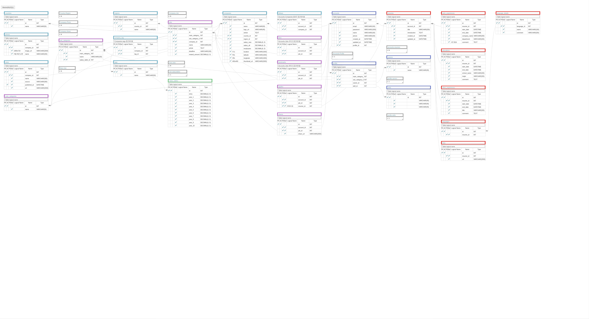

# Wepick Readme

# 원티드 클론 프로젝트

## Introduction

- Clone Site : wwww.wanted.co.kr
- Project Period : 2020.6.08 ~ 2020.6.19 | 2 weeks
- Members : 3 Front-End, 2 Back-End

## Demo

- https://www.youtube.com/watch?v=3sZc05pvuCY

## Database Modeling

## Technologies

- Python, Django
- Beautifulsoup, Selenium
- JWT, Bcrypt
- CORS Headers
- MySQL

## Features

#### Account

- 회원가입 및 로그인 (Bcrypt 암호화 및 JWT Access Token 전송) 기능 구현
- 소셜로그인 (google)
- 이메일 중복 검사
- 프로필 선택을 위한 job category & career 표출 및 프로필 저장
- 마이페이지 (profile, like, bookmark, apply)

#### Company

- region 선택
- company list & detail
- company follow(get/post)

#### Job

- 메인,서브카테고리 표출
- Job list & detail
- 메인카테고리 내 서브카테고리 정보 표출
- 서브카테고리 내 job posting 표출
- like (get/post)
- bookmark (get/post)
- apply (get/post)

#### resume

- resume list
- resume 수정 및 작성
- resume detail
- resume 삭제

## API Documentation

[WePick](https://planetary-meteor-818133.postman.co/collections/11571511-f1d5380b-682f-473e-9d9d-494a05cade48?version=latest&workspace=9b227eca-978e-433b-8cae-a42ef2c4ce1a)
